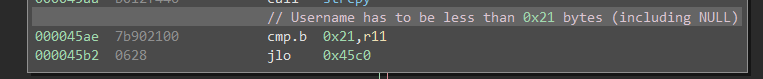
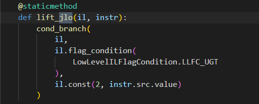
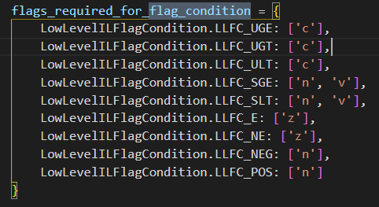
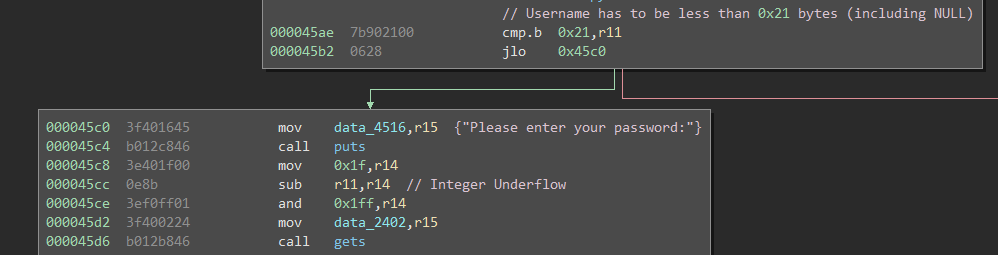
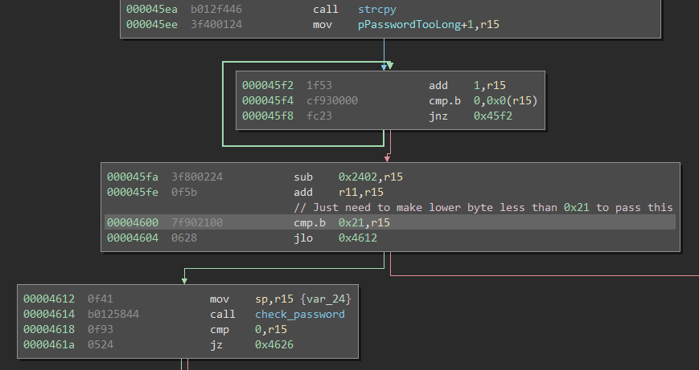

# Jakarta

This challenge is based around an integer underflow vulnerability.

This challenge starts very similarly to Santa Cruz, but with more validation on the username and password combination. White analyzing the binary, I noticed the difference in password length verification and username length verification, which lead me to believe integer underflow, but there was an interesting aside. 

## Aside
The assembly and Binary Ninja IL did not match up in this instance.

The LLIL actually lifts the JLO conditional backwards which means, it doesn't make much sense. So this lead me down the rabbit hole of finding the issue, which is pretty simple switch of some Binary Ninja LLFC enum variants.

With these fixes, we now have the correct lifting within Binary Ninja and we can continue *actual* evaluation of what is going on.

So, as a happy side effect of this challenge, we have a [issue filed](https://github.com/joshwatson/binaryninja-msp430/issues/12) and a subsequent [pull request](https://github.com/joshwatson/binaryninja-msp430/pull/13).

## Back to Work

Back to the real challenge which is centered around this integer underflow.

The issue here is that the username is being checked against `0x21` which is bytes and a NULL, while the password tries to find the remaining length in the buffer using 31 bytes maximum. So by making our username exactly 0x20 bytes of input we cause an integer underflow during the subtraction, which means that, due to the AND, we have a `gets` of `0x1FF`. The next issue we run into is the second verification of the username and password length combined, but because we have a large `gets` we can bypass this.

The "easy" solution here that happens to work is just fill all 0x1FF bytes with data to bypass this check, it happens to work in this case (0x20 - 1 = 0x1F). The more precise solution though is to only trash as much of the stack as you need to, so in this case, we just need to do some math on our buffer size. In order to bypass the check we need to lower byte of our `strlen` to be less than 0x21, so 0x00 will work. Our username buffer is 0x20 bytes, so we just need our password to be 0xE0 bytes. Once we know this it's the normal approach of overwriting the return address to the path with `unlock_door`. We could save a few cycles by jumping directly to the push of 0x7F before the `INT`, but it would likely crash right after unlocking the door due to a return address not being pushed via the `call` instruction.

The solution for this challenge is username `4141414141414141414141414141414141414141414141414141414141414141` password is `414141411c464141414141414141414141414141414141414141414141414141414141414141414141414141414141414141414141414141414141414141414141414141414141414141414141414141414141414141414141414141414141414141414141414141414141414141414141414141414141414141414141414141414141414141414141414141414141414141414141414141414141414141414141414141414141414141414141414141414141414141414141414141414141414141414141414141414141414141414141414141414141414141414141414141`