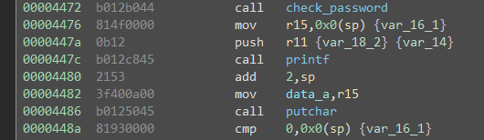

# Addis Ababa

This challenge is based around a simple format string vulnerability.

The important thing to notice about this challenge is that we are no longer working with `puts` even if you don't have symbols you can tell the code in `printf` is far more complex and has to deal with formatting characters. Another very important observation is that the `check_password` happens before your input is passed to `printf` this is required for this specific approach to work.

The final comparison in this image is the deciding factor of if the door unlocks or not. Since this has already been populated by the HSM-1 and no format filtering occurs on the user input, we can use format strings to manipulate this value. Using the debugger we can find the stack pointer at the comparison which is `0x3a78` this is our target address to change. To change it, we need to manipulate `printf` into writing to this address. Luckily the manual states that this `printf` supports `%n` which will write the number of bytes written to stdout so far to that pointer. So we need to get a pointer to our target address. This is simple as when we enter `printf` we can see what data we are pointing at, which is `0x0000` then our user input, so we can just place the address we want to write to in our user input (and it doesn't have NULLs which is a bonus), we then just use a `%x` formatter to advance the pointer (it will "print" 0x0000), then a `%n` formatter which will write 2 to the current pointer on the stack which is `0x3a78` meaning that we have bypassed the HSM-1 and unlocked the door.

The solution to this challenge (hex encoded) is `783a2578256e`