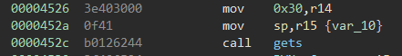
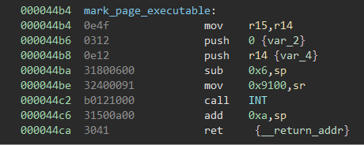
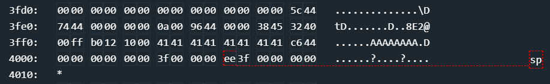
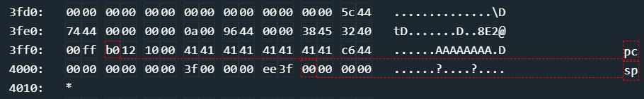

# Bangalore

This challenge is based around bypassing DEP using a stack buffer overflow.

Analyzing this challenge is very simple, so simple in fact, that there isn't actually even a call to unlock the lock, or use the HSM? (What?) Regardless, the binary is fairly straightforward, it marks all pages as executable or writable, but never both (the basis of DEP) and as such, the stack is marked writable, while the .text section is marked executable. 

The bug itself is easy to spot, a `gets` directly to the stack.



Inputing 16 characters fills the buffer, and the next two bytes overwrite the return address, which is great, this gives us control of code execution. In this challenge though, this is just the beginning. 

There are a few approaches that can be taken here, one being ROP. ROP would work well if we had more code to jump through, as it is the code is simple, there are no external libraries, and since there isn't even a call to the HSM, there isn't even a call we could steal to unlock the door. So, in this case, ROP just isn't an option. Instead, we are going to need to mess with page permissions of the lock itself. They conveniently use defined functions to mark each pages which is 0x100 bytes. Since we can write to the stack, we should change the stack to be executable, and just run our own shellcode. So to do this, we want to look at the `mark_page_executable` function.



Since we have control of code execution, and we control the stack with our buffer overflow, the goal of our exploit should be to setup our stack to look the same as it would for a real function call, this is pretty simple.

```
# This replaces the sub 0x6, sp
0000 0000 0000
# This is the page we want to mark (little endian) Page number * 0x100 is where in memory will be marked, so this is 0x3f00-0x3fff
3f00
# We want the page executable
0000
```

Since we set up the stack correctly, we can skip some of the preamble of this function, and jump directly into `0x44be` which sets up the status register for the `INT` call, it is important to note that the interrupt is now AND'd together with `0x8000`, so `0x9100` into sr will actually execute interrupt 0x11.

At this point, we can mark a stack page as executable, and we have control over the return address of `mark_page_executable` as well, so we maintain control. So we should just return to our newly executable stack! Well we need some shellcode for execution, the shellcode is pretty simple overall, just setup the status register with 0xFF00 (0x7F00 & 0x8000) and call `INT`, since this is only 8 bytes, we can just replace our starting 16 bytes of padding with it, and return back to the beginning of our buffer to unlock the lock. The final exploit looks like this.

```python
# mov 0xff00,sr
payload = '324000ff'
# call INT
payload += 'b0121000'

# Padding
payload += '4141414141414141'

# Ret to `mark_page_executable internal`
payload += 'be44'
# Padding that is expected
payload += '000000000000'
# Page to mark
payload += '3f00'
# Executable, not writable
payload += '0000'

# Return to the beginning of the buffer
payload += 'ee3f'

print(payload)
```

The solution used for this challenge was `324000ffb01210004141414141414141be440000000000003f000000ee3f`

# Aside

Originally when I was writing this exploit I planned on having the shellcode at the end of the buffer, specifically after 0x4000. This made more sense to me since I would have more room for shellcode if I needed it for some odd reason and just seemed like a better setup, but you run into a problem, if you mark page 0x40 as exectuable, and your stack pointer is on that page as well, you can no longer push to the stack (since it is not writable). There are a few ways around this, your first shellcode instruction can move the stack somewhere else writable (there is plenty of space) and continue, or you can leverage a unique aspect of your buffer location to get around it.



The stack buffer in this challenge is actually split across two pages and the stack pointer, after marking a page, is actually on page 0x40. This means we can instead, mark page 0x3F as executable, and maintain the ability to push, and more importantly to `call` since `call` pushes to the stack prior to jumping. By doing this we lose a ton of space for our shellcode, but in this instance, we don't need much, so it works out.



As seen in this image, `call` executes at address 0x3FF2, which unlocks the lock and completes the challenge. Alternatively you could try to use a `jmp` or just `ret` with the address already on the stack (Since everything is readable, and the stack isn't cleared when it is `pop`'d just incremented). There are obviously plenty of ways to get around this, but changing the executable page seemed to be the simplest route to me.
