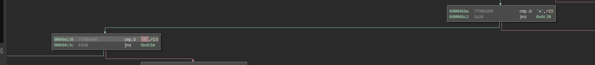
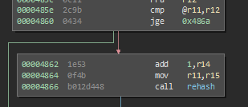
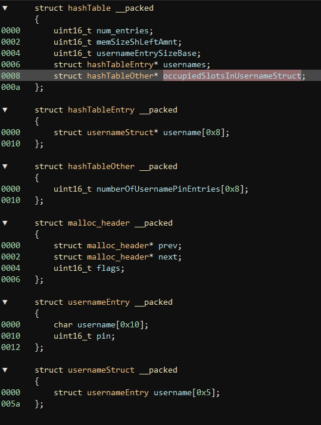

# Chernobyl

This challenge is based around a heap-allocated list with memory mismanagement.

First things first, we notice that we are only told about the "access" command, but we have no users. Between some symbol research and some super fast reversing, it is simple to pull out another command "new" for adding users.



We can add new users, with a PIN, but even when we try to login access is granted, but our new user isn't verified. So time to do a little more digging. Looking at adding a user a little more, this string sticks out.


Trying to add our PIN with a high bit set isn't allowed, so its pretty easy to determine that verification is stored in this upper bit. Since we need to be able to write to these entries at this point after they are allocated, and we have no capability to directly edit, we need a write primitive. 

Usually in these heap situations, weird things start to happen when you can double `free`, or use an object after it's `free`'d, so this seems like a reasonable next target. We have no method to force a `free`, and the only `free` in the program is in `rehash`. Looking at `rehash` it is only called by `add_to_table` and only when this comparison happens.



This comparison seemingly is comparing the number of entries in the table, stored at offset `0x5006` and a max number of 0xA, so the next step is to fill the table.

# Approach Pivot

After taking a break from the challenge and revisiting it. I noticed that there was not even a call to any method to unlock the door using a real user. Since this was the case I abandoned my old approach and focused more on the hashtable implementation itself. I took the time to go through the entire binary, reversing every implementation and adding comments, as well as figuring out the rough format of all structures.



I also broke out the hashing functionality into its own python script so I could reliably hash my own PINs and usernames. I also discovered that using the `;` character in input would allow me to process multiple new users, once I found this I experiemented with multiple useres in the length of words, such as `AA`, `BB`, `CC`, etc as it made it easier to spot in memory, as well as easily recognizable values in registers if something was corrupted.

I focused on the hashtable and how it was implemented, both through dynamic and static analysis. After far too long I noticed that usernames that hashed to the same lower 3 bits were placed in the same hashtable subdivision `usernameStruct`. The lowest 3 bits is based on the number of entries allowed in the hashtable as a whole (8 in first allocation of this challenge) - 1, so 7 (Which is the lowest 3 bits). The `usernameStruct` is hardcoded to accept up to 5 `usernameEntry`, but no validation is done in `add_to_table` to verify that the `usernameStruct` is not full. Due to this, if we can make usernames that hash to the same lower 3 bits, we can force all of them into a single `usernameStruct` and cause a heap-based buffer overflow. We can leverage this overflow to overwrite `malloc` metadata about the next heap chunk. We build a new username that hashes to match the lowest 3 bits of all previous usernames (the 6th+ username in the same `usernameStruct` causes the overflow), and follows the same exact ideas of our previous [Algiers](../14-algiers/README.md), we use the `malloc_header->flags` and some math to overwrite the `free` return address. In this case we are going to just put our trusty shellcode of 

```
push 0x7f
call INT
```

`30127f00b012ec4c` on the stack at the end of our user input, since we aren't dealing with memory protections of any kind.

The next issue we have to solve is to get `free` called. This is actually where the "useless" approach I started with has some value. The only place `free` is called is in `rehash`, and we know we can get `rehash` called once we add 12 users. Once we get `rehash` called there are some important caveats that we have to take into account for our payload. `malloc` needs to be able to complete successfully before we can get to `free`. What this means for our payload is that our `malloc_header->next` pointer has to actually point further on in memory, and not only that, but it has to point to another `malloc_header`. This is due to the implementation of `malloc` in firmware where it walks the entire heap (every previous allocation) to make sure that there is available memory somewhere (or else the program crashes with a heap exhaustion error). The simplest solution for this is to just keep `malloc_header->next` intact during the exploit. The heap is generally deterministic internally since in *most* programs, the same number of allocations will happen relative to current program state, but since we aren't dealing with ASLR, hardcoding this address is a valid approach regardless. Once we place the `next` pointer correctly, the other thing we need to worry about is the `malloc_header->flags` specifically, we need to be concerneed about the "in-use" bit. This bit tells `malloc` that this allocation cannot be re-used because it is actively in use. If you set this bit to 0, a subsequent call to `malloc` will return your in-use chunk of memory, which could be useful in certain cases! The way I approached this problem though, it would be an issue, so set the "in-use" bit in your header flags, and protect your overwritten memory. Once we get the `malloc_header` situation, it is smooth sailing. We get to free our memory, we change our `malloc_header->prev` pointer to point 6 bytes before `free`'s return address on the stack, and then overwrite it with some math from `malloc_header->flags`. Then we return to the stack to execute our trusty shellcode and unlock the door!

`new AA 1;new BB 2;new CC 3;new DD 4;new EE 5;new \xca\x3d\xfc\x50\xb9\xf4b 6;new GG 7;new HH 8;new II 9;new JJ 10;new KK 11;new Z 12;A\x30\x12\x7f\x00\xb0\x12\xec\x4c`

The solution used to solve this challenge was `6e657720414120313b6e657720424220323b6e657720434320333b6e657720444420343b6e657720454520353b6e657720ca3dfc50b9f46220363b6e657720474720373b6e657720484820383b6e657720494920393b6e6577204a4a2031303b6e6577204b4b2031313b6e6577205a2031323b4130127f00b012ec4c`