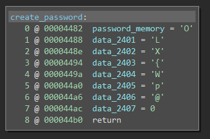
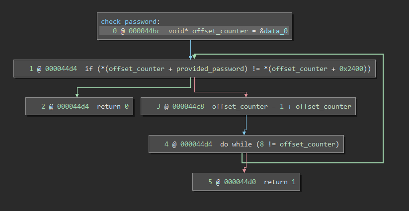

# New Orleans

Another simple static password check is found within this challenge. In `create_password` we see static memory being populated with static data. 

 

Similarly to the tutorial, we see in `check_password` that data from `get_password` is passed in to be checked against the static data offset. 

 

Within `check_password` we see that `r14` is being loaded with value `0`, and that is then being used, with an offset of 0x2400, in the comparison of the input. If any of the characters fail the whole comparison fails, once a character passes, the offset is incremented and the loop continues until the `offset_counter` equals 8. The solution to this level is the password `OLX{Wp@`.