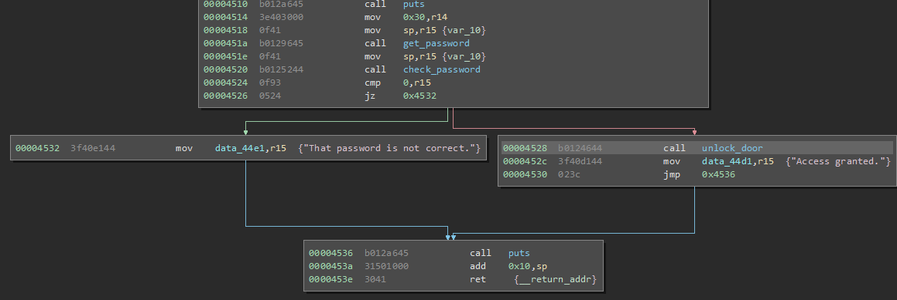

# Cusco

This challenge involves stack-based memory mismanagement, this could be considered a buffer overflow, unallocated memory usage, or in general, stack corruption.

The static approach for this challenge is to notice that the stack buffer used for the `get_password` input is never allocated (which is just subtracting the number of bytes needed from the stack pointer in this case) 

 

This means that you are trashing stack values, most importantly, return values of other functions (pushed on the stack at the time of the call). At the start of `main` we can see an `add 0xfff0, sp` which is allocating 16 bytes for use in the current function's (`main`) stack frame, using this information we know we can overwrite the return address of main by trashing 16 bytes, and the writing a new return address for the function.

The dynamic approach for this challenge is to use an easy identifiable pattern, I used `ABCDEFGHIJKLMNOPQRSTUVWXYZabcdefghijklmnopqrstuvwxyz` to see what happens to memory when running normally. With this input, the target crashes with `insn address unaligned` with a pc of `0x5251` which corresponds `QR` in my input. This shows that we can just change these bytes into the address of the `unlock_door` path `0x4528` and we have unlocked the door. Many addresses could be used here, we could jump futher into the code to save a few cycles, but there is no real reason to do this, and you could negatively impact the stability of the device.

The solution for this challenge (hex encoded) is `000000000000000000000000000000002845`.