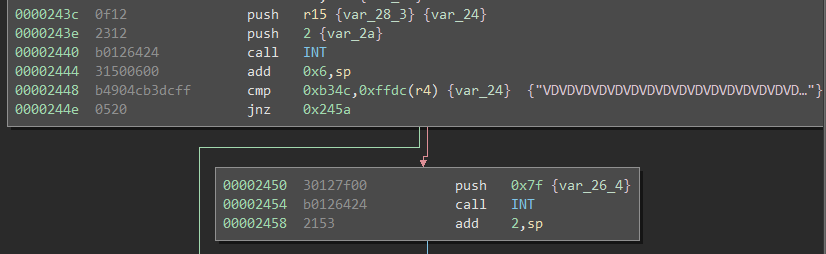

# Reykjavik

This challenge is based around run-time decryption of the executable code for the challenge. 

The static analysis approach to this problem starts in the `init` function. There are two things to notice, one the `memcpy` from what is likely `.bss` into RAM, and the call into RAM at `0x2400` this is a very common approach for run-time decryption or polymorphic code. To analyze this statically, you find the decryption routine, which is at `0x4486`, and either analyze and reimplement it, or extract it for an emulator. This is often the approach you need to take if you don't have hardware. The quick version of this is that the function takes values from the string "ThisIsSecureRight?" and XORs them with the copied `.bss` code in a rotating key stream. 

The dynamic approach, which is arguably easier in this situation is to let the program do the work for you. In order to dump the decrypted code, I just placed a breakpoint at the call into `0x2400` and then dumped all the memory and analyzed it statically from there. This works because it is only a single layer of polymorphism in this binary. Once you have the decrypted code, you can analyze it as usual.

Once you have the decrypted code, this challenge is simple. In the code decrypted at `0x2400` you can ignore most of the code except for roughly 8 lines of assembly 

 

This is a call to `gets` and then a comparison to 0xb34c, which due to little endianness, means we need to input `4cb3` to complete the challenge.

The solution for this challenge (hex encoded) is `4cb3`.