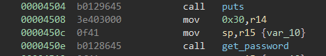
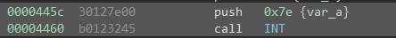

# Whitehorse

This challenge is based around the lack of memory protections within the device.

First thing to notice upon opening the file is that we see an old bug we found previously! 

 

This stack corruption means that we know we have control over the return address of the `main` function. Since the implementation of the HSM-2 means we have no real way to open the lock ourselves, we just have to make our own `INT` call with the proper arguments. We can do this because the stack is executable and not randomized in location at all, so we can build a static pointer back into the stack to call shellcode. The creation of the shellcode is dead simple, in fact we can just steal code from an old binary, or just slightly modify code in this challenge. 

 

By just changing a single byte in this code, we can make the door open even with an incorrect password. We run through once in the debugger to get our offset for the buffer in the stack which is deterministic in this challenge, and put it in our payload, little-endian and we have a solution.

The solution to this challenge is `30127f00b012324500000000000000002838`