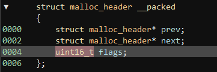
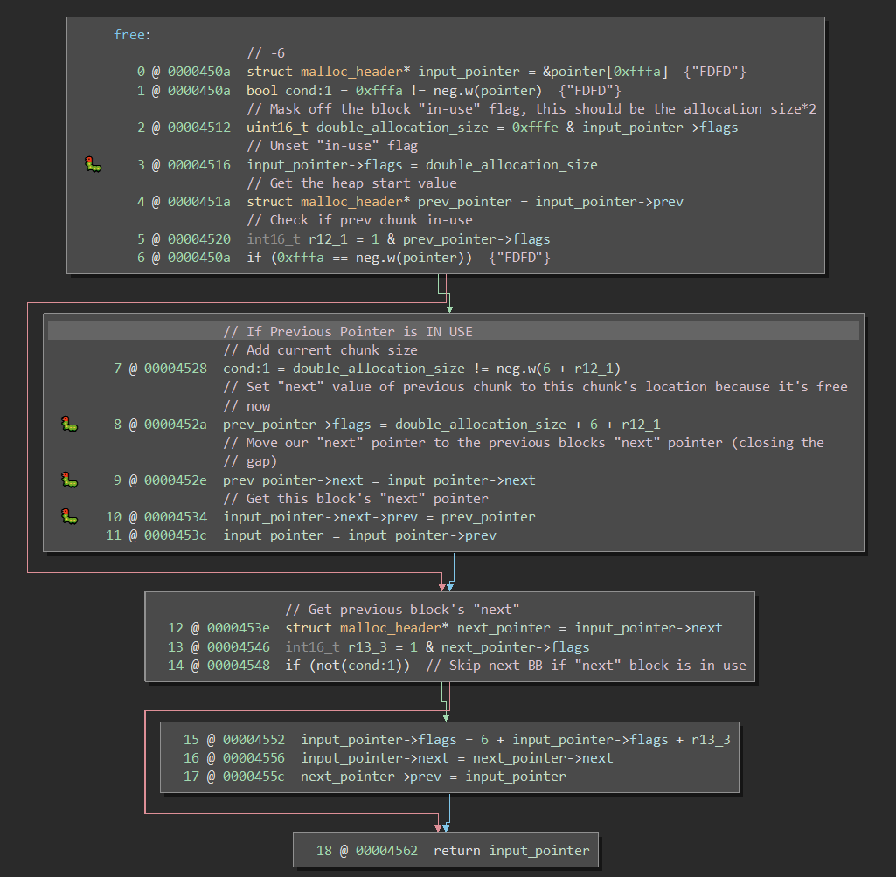

# Algiers

This challenge is based around heap corruption.

With the introduction of `malloc` and `free` in this challenge the first step is to figure out the metadata that `malloc` adds to each allocation. It is pretty simple between a debugger and the `malloc` call that the metadata is 6 bytes, this six bytes is laid out as follows



The flags structure contains the an "in-use" flag in bit 0, and then double the allocation size in the rest of the `uint16_t` this works because you can't have an unaligned accesses, so you can always use the lowest bit for this, similar to ARM and thumb mode.

Within `main` it is easy to see that the allocation sizes are not correctly matched to the `gets` sizes, thus we can use the username input to overwrite metadata for the password allocation. There is no other really interesting data that is being stored on the heap, so we don't have the ability to overwrite anything else interesting. This allows us to move on in our search. Nothing else really allows user input and most of the code is reused, we also know we have control over the malloc metadata, so a likely target is `free`.

Looking at `free`, we have a bunch of options we could attempt to use, all of these options revolve around the fact that `free` will unset flags, and fix up pointers when removing an allocation from the heap.



There are at least 4 writes that we could attempt to use, the first write is a single bit write, which can be useful in some cases, but since we aren't constrained to this write only, there are better options. The second write is the one I chose to leverage. The idea behind this exploit is to use the username heap buffer overflow to overwrite the password metadata. Specifically we are going to overwrite the password `prev` pointer with the address 4 bytes before `free`'s return address on the stack. This means `free` will attempt to use it's own return address as a `malloc_header` structure, allowing us too write `malloc_header->flags` with the value of a new return address. We do some math based on the required values, we have the current return address of `0x46a8` + 6 + (password allocation) `malloc_header->flags & 0xFFFE`. Since our target is basically the same as usual, we just want to call into `unlock_door` we will use a target address of `0x4690`, so we need -30 which as a uint16_t is 0xFFE2. We write this using the username input, to overwrite the password allocations `flags`. At this point we will overwrite `free`'s return address with our target of `unlock_door`.

```
# This just fills the username allocation buffer
41414141414141414141414141414141

# This starts overwriting the password allocation metadata

# This changes the password allocation prev to point towards the stack 4 bytes prior to free's return address
9043 malloc_header->prev

# This overwrites the password allocation's next pointer, we just need it to be aligned, any real address would work here, unimportant
0824 malloc_header->next

# This overwrites the password allocation's flags, we don't care if it is marked in-use or not since it is already past malloc. This magic number is just math to our desired return address which could be anywhere, but in this specific example free's normal return address is 0x46a8, then you add 6 for the malloc_header size, and then add this value, and that will get written as free's new return, in this case it will be 0x4690, which is unlock_door.
E2FF malloc_header->flags
```

The solution used for this challenge was username `4141414141414141414141414141414190430824E2FF` password `41` (doesn't matter)