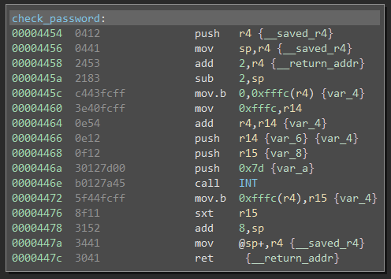
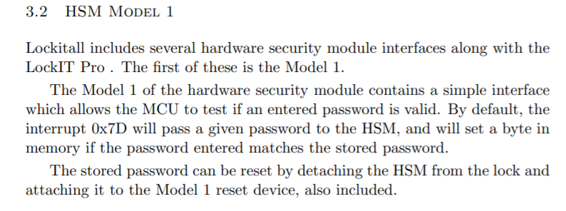
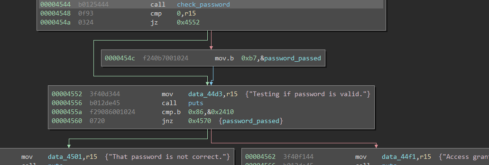

# Hanoi

This challenge involves a buffer overflow vulnerability to bypass the login check.

The first hint in this challenge is that the documented password length and length provided to `get_password` do not match. The documented password length is between 8 and 16 bytes, while `get_password` is passed `0x1c` which is 28 bytes. This means that the user controls from `0x2400` all the way to `0x241c`. Given the new `check_password`  we now see some interaction with the hardware security module.  The documentation is pretty lacking, not stating what the HSM will set the byte in memory to, but luckily it doesn't matter. The code does not actually rely directly on the byte set from the HSM and instead uses the value returned from the HSM to determine if it should write a byte to the address `0x2410` to show that the password check passed.  If we purposely fail this test, and use the buffer overflow previously mentioned from `get_password` we can directly write the value expected at that memory location and bypass the password check.

The solution is an input of (hex encoded) `8686868686868686868686868686868686`