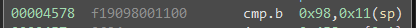

# Johannesburg

This challenge is based around the idea of simple stack cookie.

The goal of this challenge hasn't changed from previous stack corruption with the HSM-1. We want to call `unlock_door` which is at `0x4446`, we could right shellcode to do whatever wanted, but this is the goal for this scenario. The only thing that has changed is the fact that our input is NULL filtered (`strcpy`) and we have a stack cookie to deal with in order to trigger our return address overwrite.  This is a simple cookie that checks to ensure that the byte after the 16 byte password is a set value. Since we can write up to 0x3F bytes, and the cookie is a static value, we could just write every value to bypass this (assuming it is a compile time cookie and doesn't change every run) if we were bypassing this black-box. All we need to do in our payload is to make sure we re-write the stack cookie so we pass the length check and can trigger our return address control, at which point we call `unlock_door` again.

The solution to this challenge is `4141414141414141414141414141414141984644`