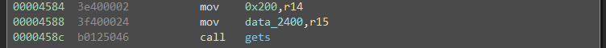
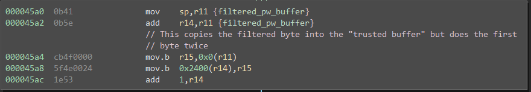
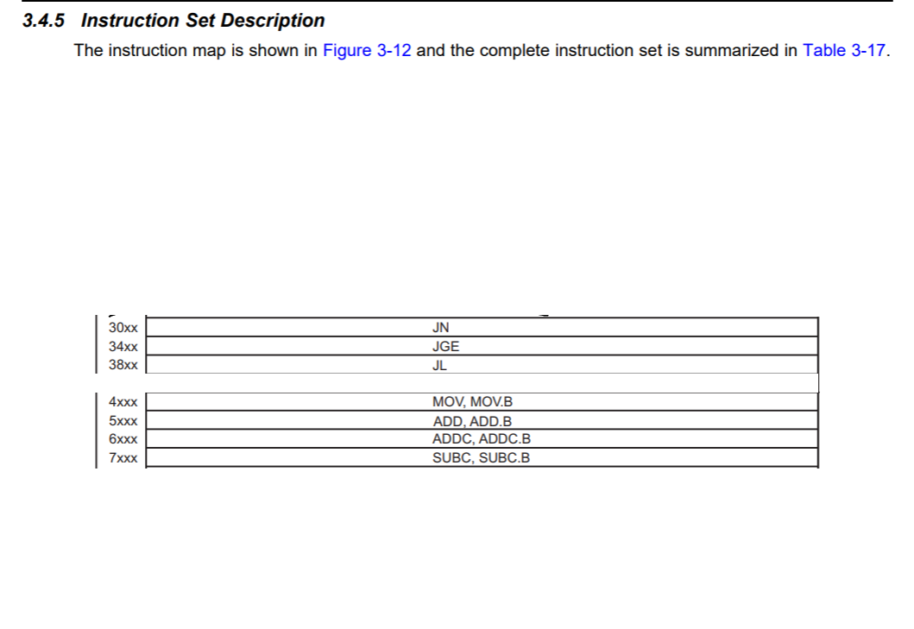
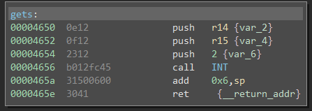

# Lagos

This challenge is based around bypassing filtered input.

This challenge is mostly a test in patience more than anything else, which does not make it extremely exciting. The bug is easy to spot.




The 0x200 bytes copied to the .data section are copied onto the stack once they are filtered. This gives a return address overwrite, but only with filtered input. The first thing to check is that the filter is correct.

```
Acceptable Characters
0-9 ascii
A-Z ascii
a-z ascii
```

In this case it is, there is an oddity where the first character is checked and copied twice, but I don't end up using that for anything. 

At this point we have control over code execution, (breezing over figuring out padding to get this, because I have already covered that a bunch) but only in the ASCII range of 0x30-0x39, 0x41-0x5a, and 0x61-0x7a all inclusive. We can try to write shellcode with this, but a quick look at the instruction set table shows this is going to be a huge pain.



These are the only instructions that are ASCII range, and then we still need to filter based on argument type, register number, etc. You *might* be able to accomplish something like this, but it will be a huge time sink.

The other approach is to just get more user input into the system and jump to that. The simplest way to do this would be just to call `gets` again.



Looking at `gets` we struck gold, The address is in the ASCII range, and we can call into it at `0x4654` to deal with setup we cannot do. Since we aren't dealing with protections we don't have any other limitations, so we just take the easy route of setting up `gets` to write  BB bytes (0x4242), to the address BB (0x4242). Once we call this, we will be asked for more user input, which is unfiltered, we can just fall back to our faithful shellcode of 

```
push 0x7f
call INT
```

or `30127f00b012fc45`. Then we just set up our stack so that we return to our new buffer at BB (0x4242) and we end up with our completely absurd payload of `AAAAAAAAAAAAAAAAATFBBBBBB`.

The solution for this challenge is `AAAAAAAAAAAAAAAAATFBBBBBB` followed by `30127f00b012fc45`

# Aside

This challenge also included `JHS` instructions that were lifted backwards during LLIL lifting, as noted [here](https://github.com/joshwatson/binaryninja-msp430/issues/11). So I went ahead and fixed that issue as well and added it to my [pull request](https://github.com/joshwatson/binaryninja-msp430/pull/13).