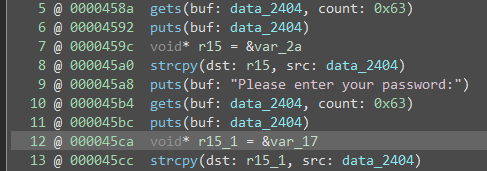
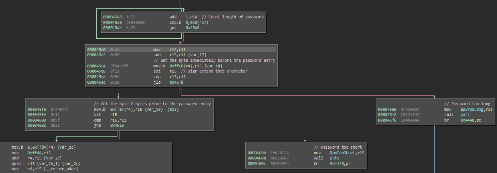
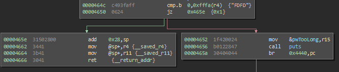

# Santa Cruz

This challenge focuses on both a stack-cookie like limitation and stack corruption.

This is really where the challenges start to get interesting. The introduction of the username seems to be an interesting addition to this challenge. The first thing to notice is that the `gets` calls get more data than they need, for both the username and the password 

 

Both get 0x63 bytes and are passed to a `strcpy` this means that obviously this is not the mechanism used to enforce the length of the password. Another interesting fact is that both of these `strcpy` calls have the ability to overwrite the return address, based on the stack offsets of `0x2a` and `0x17`.

Immediately following the `strcpy` call for the provided password we see some validation done on the password 

 

This validation uses bytes prior to the password buffer to validate that the password is between 8 and 16 characters. The issue here is that we can ovewrite these bytes with our username data, thus making the password as long, or short, as we want (up to 0x63 bytes). One would assume we could then pivot to our return address corruption via the password entry, but this is thwarted prior to the return of the program via a single check 

This check verifies that the byte 17 bytes after the password buffer is NULL. If the previous checks were successful, this would prevent exploitation with just the username field, because you cannot write a NULL within the username input. In order to exploit this, we actually need to chain these vulnerabilities together, we use the username input to bypass the length checks of the password, input a password that is 17 bytes long (and a NULL is automatically appended as an 18th byte) then we use the rest of the username input (password input is written over top of it) to provide the rest of our exploit. 

The rest of the exploit itself is not terribly interesting, we pad to the return address with non NULL bytes and then we return to `unlock_door`, as usual. We could return anywhere, we still have no memory protections so, the sky is the limit.

The solution to this challenge is username `010101010101010101010101010101010101FF11111111111111111111111111111111111141424344454a44`
password is `4444444444444444444444444444444444`