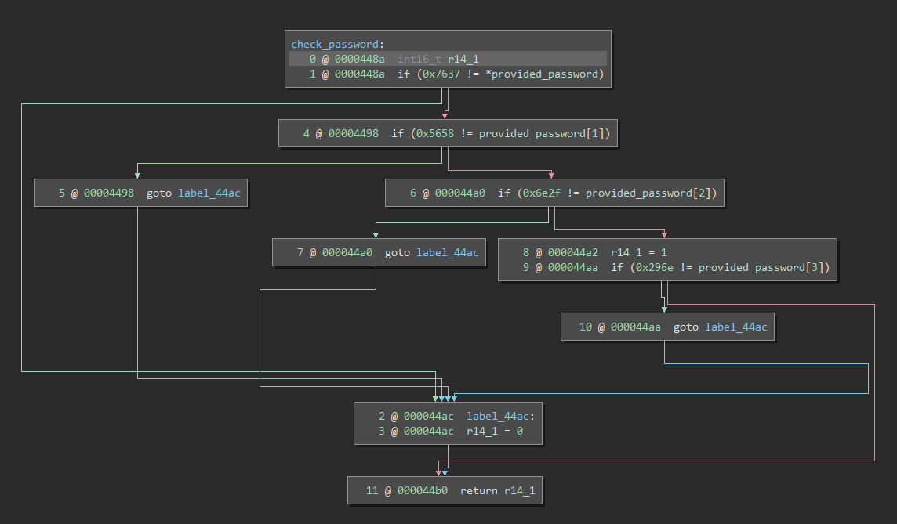

# Sydney

Another simple comparison solution in memory. The only function of interest here is `check_password` as everything else stays relatively the same from previous challenges. 

 

We can see that the password check is done in 16 bit increments and the only challenge here is to know that MSP430 is little endian so data is stored least significant byte first, this means that we need to account for it being "backwards" when we enter it into memory. The password for this level (in hex encoding because of the newline) is **377658562f6e6e29**.