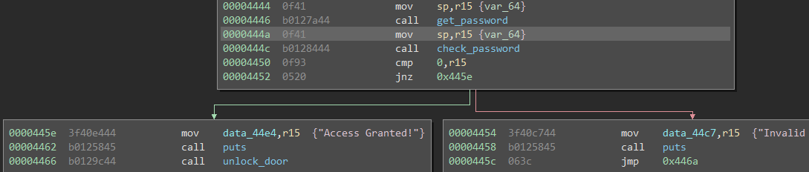
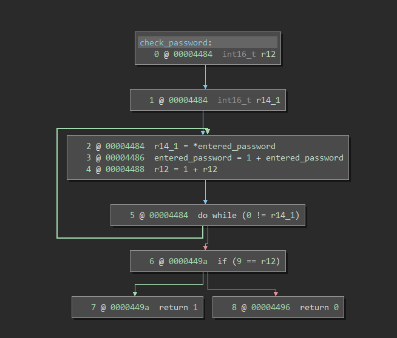

# Tutorial

This is an extremely simple level where the password check is only done via the length of entered input.

In main,  We can see that a stack pointer is passed into both `get_password` and `check_password` which without modifications, is the same pointer.

Once inside `check_password`  we can see the the loop is incrementing the value of a counter searching for the NULL termination of the string and checking the length (**NULL inclusive**) against 9. In this case any password of 8 characters will work such as `password`, the null termination is automatically added.