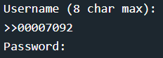
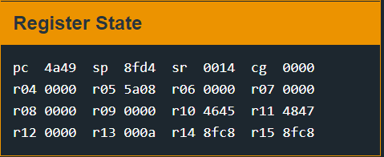
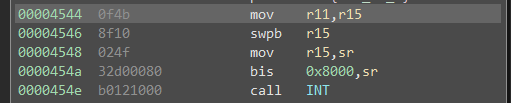

# Vladiovstok

This challenge is based around address space randomization bypasses.

Starting off this challenge is a pain to look at because it uses randomization to move the binary around. When looking at it statically you can ignore randomness for the most part and just look at the data that is being `memcpy`'d in a large block of 0x1000 bytes. In addition to address randomization the code looks to be thrown through an obfuscator that adds a bunch of useless instructions, as well as "guards" to the calls to `INT` (If you put anything with bit 4 set in R15, it will turn off the CPU because it is put in the Status Register). If this binary was larger or this was a longer term project. It would be worth the time and effort to prune those dead instructions to get something more sane to look at, but Binary Ninja tends to do this fairly well automagically. 

After some brief looking statically at the binary, this challenge is easier to interact with and see what we may have access to. The first step, since the username is printed back out to you, is to check for format string attacks. since user data is piped into `printf` directly we can leak addresses with `%x`, specifically 2 `%x%x` gives out something interesting (everything else is NULL). If we cross reference the address, we see it is in the dynamically relocated .text section, but we can cross reference this back to our static .text section as well. This leaks the address of the first instruction in `printf` this essentially bypasses the .text section randomization since it copies the entire binary in a big block, we can just calculate all references based on that leaked address. We still don't know where the stack is, since that was randomized separately, but we can do attacks similar to return to libC. Since a single byte write over a `printf` instruction isn't going to be useful, `%n` isn't going to do much good for us here.



Once we come up to the password without spending a bunch of time on analysis, we can just test out common bugs, starting with a long unique pattern. In this case we just use `ABCDEFGHIJKLMNOP` and see if anything happens. It does, and the lock crashes on an unaligned instruction. At this point the register state tells us almost everything we need for an exploit.



We have control over PC with `IJ`, r10 with `EF`, and r11 with `GH`. Since we have no leak for the stack, we can't write shellcode to run directly, instead we have to reuse code already found in the binary since we can calculate all of those offsets. At this point, we look through all the "gadgets" we have access too, specifically anything that targets an `INT` call since we need to unlock the door. I settled on code found in main.



This code loads the value in r11 into r15, byte swaps, copies it into the status register, then calls `INT`. So all we need to do is make sure that r15 is populated with 0x7F prior to `INT` and we have unlocked the door. The only change in this exploit is that the addresses are dynamic, you have to build the payload after you have completed the leak by taking the leaked address subtracting 0x226, then fixing the address for little endian.

Ex: Leak is `0xb9d2`

```
0xb9d2 - 0x226 = 0xb7ac

Payload will be:
4242424244447F00acb7
```


The solution used for this challenge is username `%x%x` and password is `4242424244447F00 + (leaked address - 0x226 and fixed for endianess)`